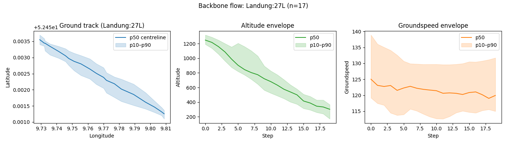
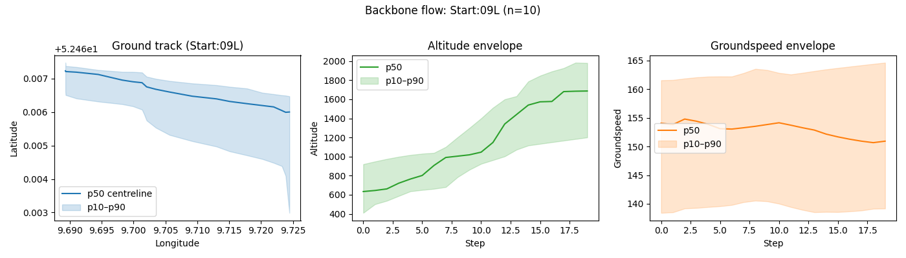
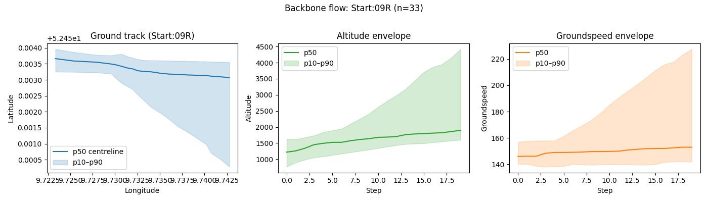

# Backbone Tracks: What, Why, and How (in simple terms)

## Overview
- Quick reference for how backbone tracks are built and interpreted.
- Suitable for simple edits/additions under each heading/subheading.
- Last updated: 2025-12-03 18:00 UTC

### Update log (chronological)
- 2025-12-03 18:00 UTC: Added explicit log entry and timestamp for the UTM-based pipeline changes and control-flow summary; documented the generation steps for backbone entries.
- 2025-12-03 00:00 UTC: Added UTM-based preprocessing/clustering/backbones (EPSG:32632), configurable via YAML. Pipeline flow: load → ensure required cols → optional UTM conversion → segmentation → (optional test caps) → smoothing/resampling (UTM) → per-flow clustering (OPTICS/KMeans on UTM) → backbone percentiles (UTM) → optional plots → save outputs.

## What is a “flow”?
- A flow is just a group of flights that share the same direction and runway.
- In our case, flows are defined by two columns: `A/D` (Start/Landung) and `Runway` (e.g., `09L`, `27R`). Every flight with the same `A/D` + `Runway` is grouped together.
- If you ever want finer splits (e.g., by aircraft type), add that column to `backbone_keys` in `config/backbone.yaml`.

## What is a backbone track?
- Think of a backbone track as the “typical path” for a flow.
- For each flow, we take all flights in that flow, smooth and resample them to the same number of steps, then compute simple statistics (p10, p50, p90) at every step.
- The result is one row per step per flow, with percentile envelopes for key variables (latitude, longitude, altitude, groundspeed, etc.).

## What are p10, p50, p90?
- p10: 10% of flights are below this value and 90% are above (lower bound).
- p50: the median—half the flights are below, half above (centre line).
- p90: 90% of flights are below this value and 10% are above (upper bound).
- In plots, p50 is the centreline; p10–p90 is the shaded band showing spread.

## What does “normalize types” mean?
- We ensure columns have the right data types so later steps behave predictably:
  - `timestamp` → convert to datetime.
  - Numeric columns (`latitude`, `longitude`, `altitude`, `groundspeed`, `track`, `dist_to_airport_m`, `vertical_rate`, `geoaltitude`) → convert to numbers, forcing bad strings to NaN.
  - Categorical columns (`A/D`, `Runway`) → uppercase/strip whitespace so values like `09l`, ` 09L `, `09L` become the same.

## On what basis are rows dropped?
- After type conversion, rows missing required columns are removed. Required defaults are: `timestamp`, `A/D`, `Runway`, `latitude`, `longitude`, `altitude`, `groundspeed`, `track`, `dist_to_airport_m`.
- Reason: without these core fields, a point can’t be placed in time/space or flow, so it can’t be used to build a trajectory.

## What is the Savitzky–Golay smoothing?
- It’s a gentle smoothing filter that reduces noise while keeping the overall shape.
- For each numeric column in a flight, we slide a small window and fit a low-degree polynomial (order up to 3) inside that window. The window length is capped and adjusted so the polynomial order is always less than the window size.
- This suppresses spiky ADS-B noise but keeps the main path intact.

## How are backbones built (step by step)?
1) Load matched trajectories which was matched using the Noise excel sheet and adsb data with A/D and Runway info (`Enhanced/matched_trajs_april_2022_with_ad_runway.csv` by default).
2) Normalize types and drop rows missing required fields.
3) Group by flight identifiers (`MP`, `t_ref`, `icao24`) to isolate each flight.
4) For each flight:
   - Remove outliers per numeric column.
   - Smooth with Savitzky–Golay.
   - Interpolate to a fixed number of steps (default 20). Flights with fewer than 3 valid points after filtering are skipped.
   - Attach flow tags (`A/D`, `Runway`).
5) Aggregate by flow (`A/D`, `Runway`):
   - Stack all resampled flights in the same flow.
   - For every step and every numeric variable, compute p10/p50/p90.
   - Save one row per step with these percentiles and `n_flights`.

## What do the plots show?
- One set of panels per flow:
  - Ground track: longitude vs. latitude (p50 centreline, p10–p90 band).
  - Altitude envelope: p50 line with p10–p90 shading over the 20 steps.
  - Groundspeed envelope: same idea for speed.
  - `n_flights` in the title is how many flights contributed to that flow’s backbone.

## Key files and knobs
- Input data: `Enhanced/matched_trajs_april_2022_with_ad_runway.csv` (default).
- Backbone config: `config/backbone.yaml` (set `backbone_keys`, required columns, target length, test mode). The current config is in test mode.
- Generation script: `scripts/generate_backbone_tracks.py` (reads config, writes `reports/backbone_tracks.csv`).
- Visualization script: `scripts/visualize_backbone_tracks.py` (plots centrelines/envelopes; use `--flow Start:27R` etc.).

## Common questions
- “Why do axis ticks look tiny (e.g., 0.001)?” Matplotlib auto-offsets when values are close; actual latitudes are around 52.x. You can disable offsets in the plotting script if desired.
- “Why warnings about short trajectories?” Outlier filtering can drop points; any flight with fewer than 3 remaining points is skipped. These skips are logged but don’t stop the run unless every flight is too short.

## Data source and required parameters
- CSV used: `Enhanced/matched_trajs_april_2022_with_ad_runway.csv`.
- Required columns (default): `timestamp`, `A/D`, `Runway`, `latitude`, `longitude`, `altitude`, `groundspeed`, `track`, `dist_to_airport_m`.
- Flow keys: `A/D`, `Runway` (defines the backbone grouping).
- Target length: 20 steps per processed flight.
- Test mode (enabled in `config/backbone.yaml`):
  - `test_mode: true` skips the `--test` flag and uses config to keep runs fast.
  - `test_max_rows`: cap on input rows ingested.
  - `test_max_flows`: cap on distinct `A/D` + `Runway` combinations processed.
  - `test_min_group_size`: lowers the minimum flights per flow when testing.
  - Set `test_mode: false` when you want full data processed.

## Plots
- Runway 27L: 
- Runway 09L: 
- Runway 09R: 

## Grouping decision: include MP or not?
- Current setup uses `group_keys: [MP, t_ref, icao24]`, which yields one trajectory per measuring point (MP) per flight. The same aircraft can appear multiple times if multiple MPs see it.
- If you want a single trajectory per flight regardless of MP, remove `MP` from `group_keys` (e.g., use `[t_ref, icao24]` or another unique flight key). That way, multi-MP observations merge into one trajectory for clustering/backbone generation.
